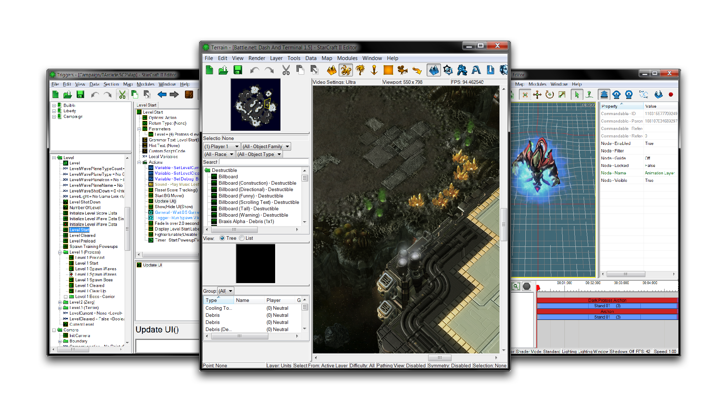
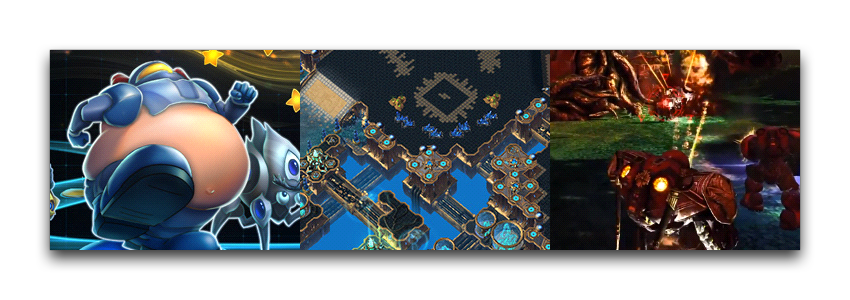
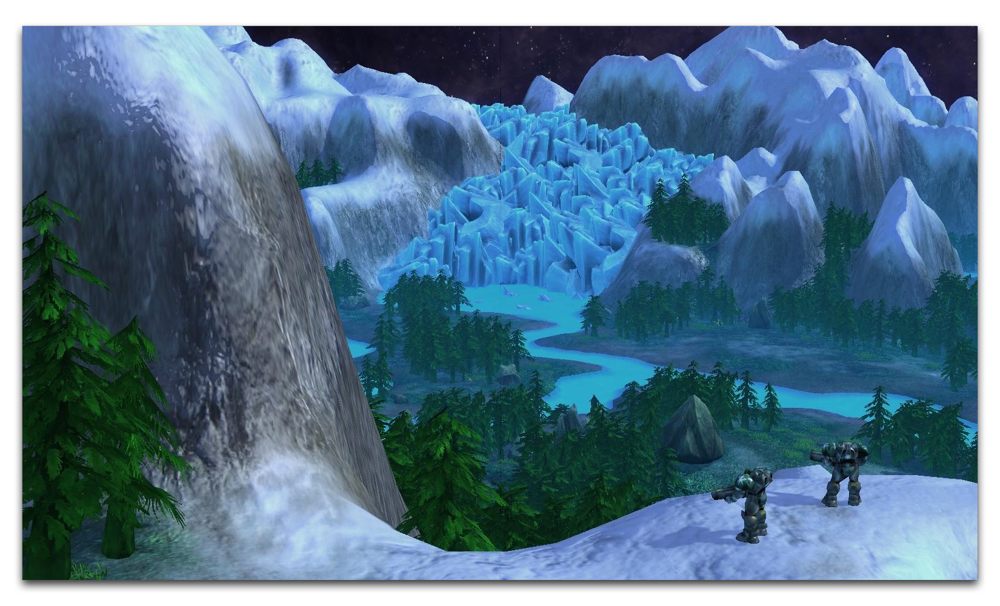

INTRODUCTION
============

The StarCraft II Editor is a suite of tools for game development bundled
with StarCraft II. These are the very same tools Blizzard themselves
used in the development of the latest version of StarCraft. Together
with Battle.net and the Blizzard Arcade, the Editor offers a robust
game-development platform, hosting system, and multiplayer network.

Editor Tool Suite

The StarCraft II Editor was first released with Wings of Liberty in
2010, giving players access to all of the game\'s art and assets. This
continues Blizzard's tradition of offering its player community full
access to its own creative tools, which began with the release of
WarCraft II: Tides of Darkness in 1994. With each edition of StarCraft
II, more has been added to the Editor, including an official pack
containing all of Warcraft III\'s assets.

THE ARCADE
----------

The StarCraft II modding community has responded by creating thousands
of custom maps and mods. All of their creations can be found on a
Blizzard-hosted platform called the Arcade, which players can access
using the StarCraft II game client. In the Arcade players can discover,
play, and share in a vibrant online game development community. Using
the Editor will give you access to this community, including the ability
to exhibit your own projects, present them to an audience, get feedback,
explore other people\'s games, get inspired, and most of all play.

Games in the Arcade

CAPABILITIES
------------

The Editor is a professional-quality game engine with a broad range of
features, including its own scripting language. Despite that, you won't
need coding experience to get started. If you\'d like to start educating
yourself on how to use the Editor, then you've come to the right place.
This site serves as an essential manual and course plan for anyone
learning to use the StarCraft II Editor. So read on for an introduction,
then start exploring the site.

Thanks to its history as one of the first community tools for map
design, the Editor is often referred to as the 'Map Editor.' However,
the Editor stretches far beyond simple map creation. It is robust game
engine that you can use to build a diverse range of games, maps, and
modifications to the StarCraft II experience.

Some of the Varied Community Creations

If you're a fan of competitive StarCraft II, you can create new melee
maps for other StarCraft II players to battle on. Your map could even
become popular enough to be the setting for the decisive game in a
premier eSports championship.

From there, you can being to tweak and explore StarCraft's gameplay. You
can apply custom data modifications to any existing StarCraft II melee
map, including maps you've created yourself. You can then build your
maps out into full custom campaigns, telling your own stories in the
world of StarCraft.

Alternatively, you can set out to create your own game type. Developers
have made things from simple environments, to complex tower defense
maps, and even sprawling RPG epics. You can draw inspiration from the
long history of custom games from Warcraft and StarCraft, a vibrant
modding culture that birthed genres like Tower Defence and Hero
Brawlers, such as DotA and our own Heroes of the Storm (a game whose
prototypes were built in the StarCraft II Editor).

THE MODULES
-----------

Modules are major divisions of the main Editor. Each presents a smaller,
more focused editor for a specific section of the game development
process. As individuals tools each Module is highly specialized. As a
whole, they give you the creative control you need to build an entire
game.

Terrain Editor: The terrain Editor allows you to sculpt the terrain and
give game worlds. Melee mappers can paint landscapes for competitive
battles, and for other type of creations this is the main tool for
building a world's appearance.

Trigger Editor: The Trigger Editor is where you'll bring life and logic
to your game. You can choose to use either StarCraft II\'s internal
scripting language or a helpful GUI system suitable for newcomers to
programming.

Data Editor: The Data Editor is the storehouse for both the existing
game assets and your own unique creations. Here you can engineer things
like units, buffs, abilities, effects, sounds, and more. As you gain
experience creating games, these creations will always be there, ready
to be repurposed in new playfields.

Importer: The Importer allows you to introduce custom-designed assets
from outside the Editor, including 3D

models, images, music, or anything else you need.

UI Editor: The UI Editor gives you the tools to define and create custom
interfaces, or to alter those already found in StarCraft II.

Cutscene Editor: The Cutscene Editor allows you to create your own
cinematics, serving as a tool for both in-game storytelling and
Machinima content to be presented outside the game.

Text Editor: The Text Editor allows you to change fonts, styles, and
other typographical effects in the game\'s texts.

AI Editor: The AI Editor is where you'll create and alter the artificial
intelligence that determines unit actions, make an ultimate competitive
foe, or define the thinking for your custom game\'s computer-controlled
inhabitants.

ONWARD!
-------

Now is the perfect time to start learning and creating. This site will
serve as a guidebook while you launch yourself into the many creative
possibilities of the StarCraft II Editor. Read on, and remember to have
fun.

Adventures await! (credit: njordys)
