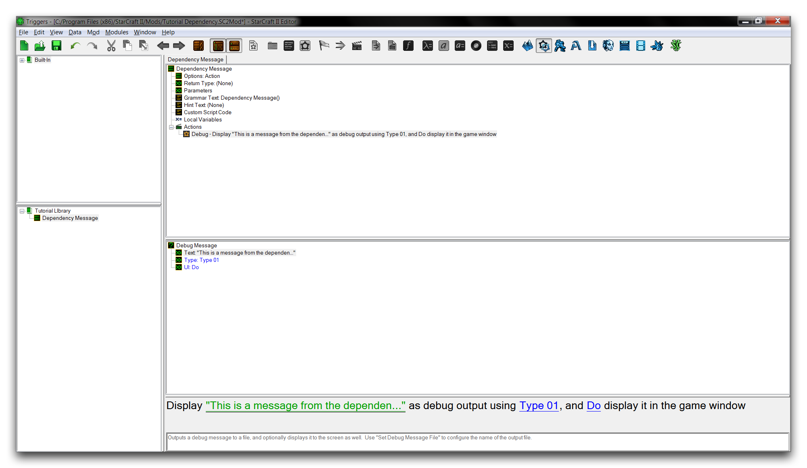
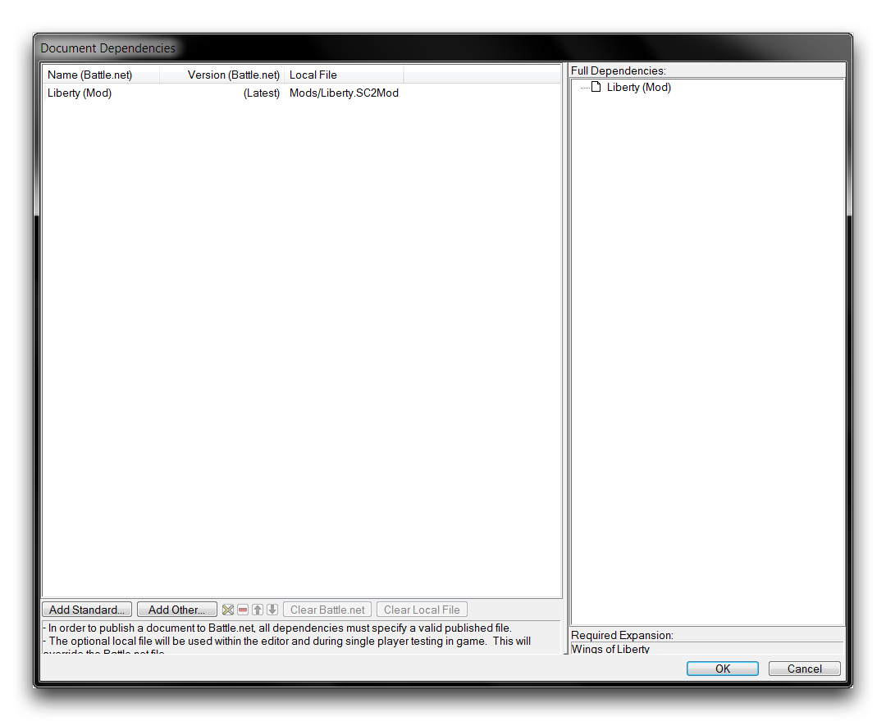
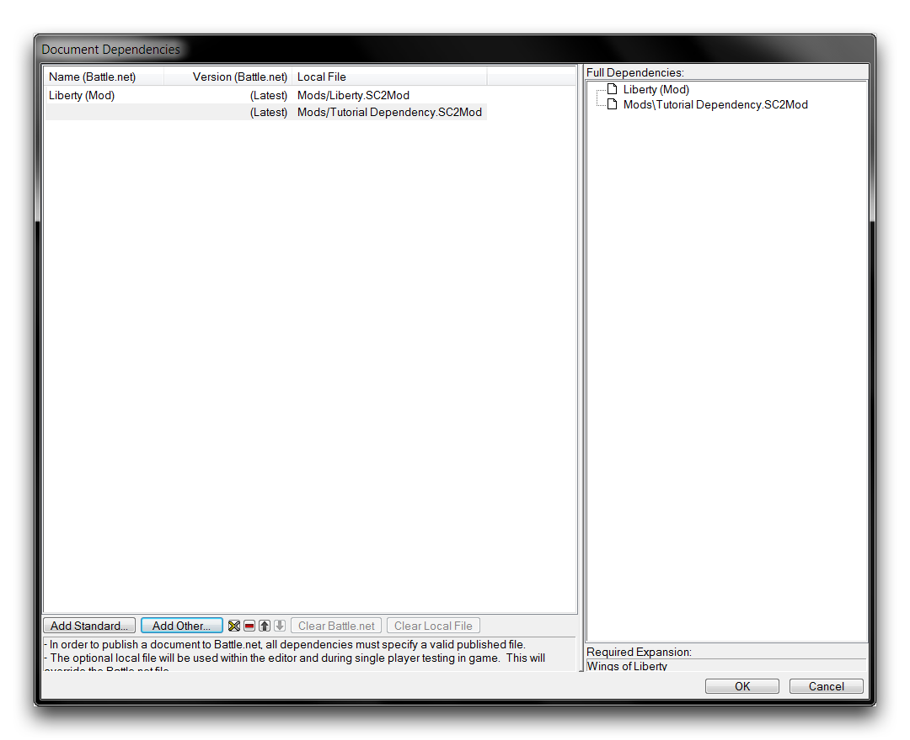
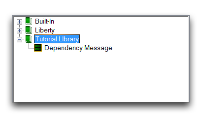

CREATING MODS
=============

Although map files are always the final product of the Editor, mod files
are the real heart of any project. By separating data from the
constructed map, mods allow for projects that can be more freely
developed and shared. This relationship goes beyond ease of use. Mods
expand the possibilities of projects to extents that have never been
possible in a Blizzard Editor. The best way to discover this is by
experimenting with the Editor's ability to construct, combine, and
utilize mods.

BUILDING A BASIC MOD
--------------------

Create a new document by navigating to File -\> New. This launches the
'New Document' window, in which you should choose to create a 'Dependent
Mod.' Click 'Next' to proceed to the 'Choose Dependencies' heading,
select 'Custom,' then click 'OK.' Now use the Terrain Module to navigate
to Mod -\> Mod Info, launching the 'Mod Properties Window.' There, enter
the title 'Tutorial Dependency' into the 'Name' field. You can also
enter a description stating that, 'This is a tutorial dependency.' Use
the image below as a guide.

Mod Creation & Configuration Order

You have now created a simple mod. The 'Dependent Mod' is the basic mod
type. Its name comes from the fact that any map inserted into a mod
enters into a relationship known as a Dependency. When you selected
'Custom' under the 'Choose Dependencies' view and left it blank, the mod
file was set to have no base dependencies. An empty mod is the best
starting point for an entirely custom starting project. The only
information in your mod is the few details included in the last step.

Save your mod to your preferred location under the name 'Tutorial
Dependency.' StarCraft assigns the .SC2Mod file extension to mods.

ADDING DATA TO A MOD
--------------------

A mod's eventual purpose is to be a container for assets. You can learn
more about this by populating your basic mod with some triggers. Note
that a mod file will require a trigger library to hold its triggers.
This is not the case for map files, which can support triggers that are
outside of a library.

Move to the **Trigger Module**, here you'll create the Trigger Library.
Do so by right-clicking on the **Triggers Panel** and navigating to
Library -\> New Library. The new library will appear in the List Panel.
Rename it to Tutorial Library. Now add an action definition by selecting
the Trigger Panel again, navigating to New -\> New Action Definition.
Rename this definition to 'Dependency Message.' In this action
definition, add a new action via Actions -\> Debug Message. Finally,
change the text field of this action to, 'This is a message from the
dependency.' You should end up with something that looks like the image
below.

Mod's Trigger Library

USING A MOD AS A DEPENDENCY
---------------------------

Now that you've set up your mod file, you'll need to create a new map
file to test it as a dependency. You can do so by navigating to File -\>
New -\> Arcade Map. Click 'Reset to Defaults' on the terrain screen, and
save this map as 'Tutorial Mod Test.'

To add a mod as a dependency to this map, navigate to File -\>
Dependencies. Based on the default map configuration, the 'Liberty
(Mod)' standard dependency has already been included. Since you want to
add a custom mod, select 'Add Other.'

Dependency Adding View

This will launch a 'Choose Document' window that gives access to mod
files both stored locally and on Battle.net. In this case, you've
already saved the desired mod file locally. Find it using the supplied
file browser and click 'OK,' after which you'll be sent back to
dependency selection screen.

Custom Dependency Added

Finish adding the dependency by hitting 'OK,' then reopen the Trigger
Module. Now is a good time to make sure you enable library viewing,
which you can do from View -\> Show Libraries. The trigger assets within
your custom mode should be visible now and ready for use. In the List
Panel at the top, you'll see that there are libraries of triggers titled
Built-In, Liberty, and Tutorial Library.

Imported Library from Mod

Test the dependency's functionality by adding a 'Dependency Message'
action to the Melee Initialization trigger in the map. Right-click under
the 'Actions' heading, then navigate to New -\> New Action -\>
Dependency Message. Note that the imported action definition will show
its source as 'Tutorial Library,' rather than the Blizzard libraries
'Built-in' or 'Liberty.' From here, delete all of the extraneous default
melee actions. This will leave you with the following setup.

Dependency Action Definition in Use

Running your document as a test should now deliver a result similar to
the image below.

Output from Dependency Library
