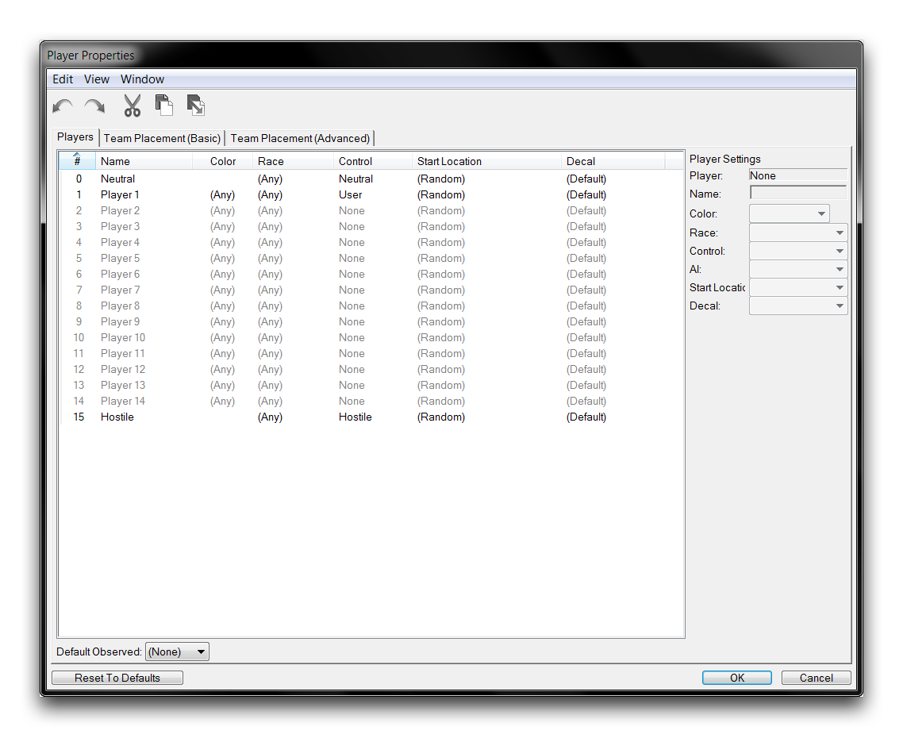

PLAYER PROPERTIES
=================

Player Properties is where you'll find many essential options for
settings up your game. You can find them by navigating to Map -\> Player
Properties from any module of the Editor. This will launch the window
shown below.

Player Properties Window

PLAYER PROPERTY FIELDS
----------------------

Player Properties addresses questions of control, start location, race,
and color. In that regard, it is similar to the typical Battle.net
lobby. Changing these properties will influence how the game lobby
appears when playing online. However, these options extend further, as
they also control global properties relevant to non-traditional games.

The following table details the options in Player Properties, along with
a description of each.

  -------------------------------------------------------------------------------
  Action     Effect
  ---------- --------------------------------------------------------------------
  \#         A number used for ordering and referencing players.

  Name       A multipurpose ID. This is typically displayed when highlighting a
             unit owned by the named player, but it can be used in other
             capacities. In online games, the player's Battle.net ID is always
             displayed as the Name property. Names are not displayed for units
             owned by Hostile or Neutral controlled players.

  Color      Determines a player's team color. If set, this is unchangeable in
             the game lobby. Unlike melee play, multiple players can be assigned
             the same team color. There are 16 color options in total, setting
             (Any) will allow players to choose their color from a lobby.

  Race       Determines a player's race from the options Protoss, Terran, Zerg,
             Neutral, or (Any). Selecting Neutral will set a player's race to
             random, while setting (Any) will allow the player to choose their
             race from the lobby.

  Control    Determines the controller for each player slot. User creates a slot
             for human players, adding an open slot in the game's lobby that can
             be filled with either a human player or an AI controlled computer.
             None sets a player slot to no player. This is the default value.
             Computer creates a player to be controlled by the game's default AI.
             Neutral creates a computer-controlled player that has a Neutral
             Alliance setting with all other players. Hostile creates a computer
             controlled player that has an Enemy Alliance setting with all other
             players.

  Start      Determines where the default units are created via the 'Create Melee
  Location   Starting Units For Each Player' action. In all other map types, this
             controls the starting location of a player's camera, unless
             otherwise specified.

  Decal      Sets the default decal used for any of a player's units that support
             decals.

  Default    Determines the camera settings of Observer players when no specific
  Observed   player's vision is being viewed.
  -------------------------------------------------------------------------------

Note that, while there are 16 player slots, StarCraft II supports a
maximum of 15 human players. At least one slot must be set to Neutral,
Hostile, or None. This includes players observing an online match.

CUSTOMIZING PLAYERS
-------------------

In melee maps, player properties alone can be used to customize
scenarios. See below for a method of creating a simple Protoss versus
Zerg themed map.

Custom Game Player Properties
