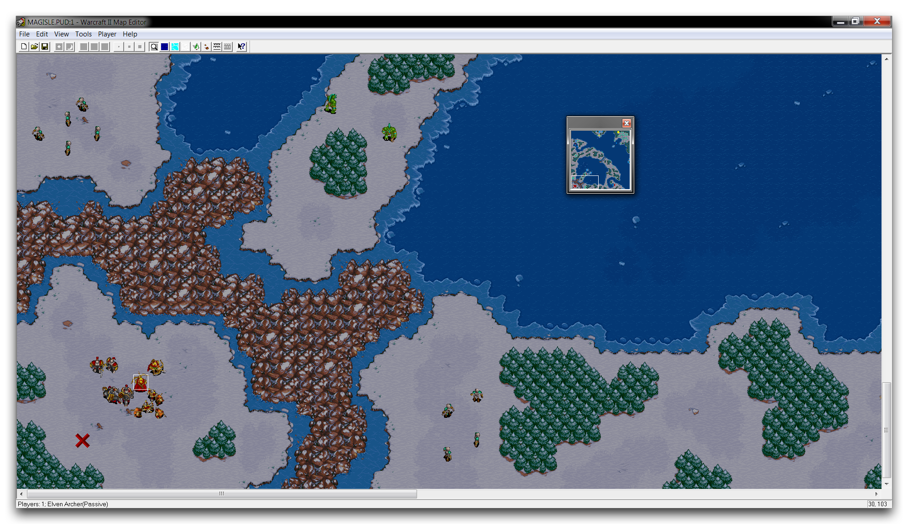
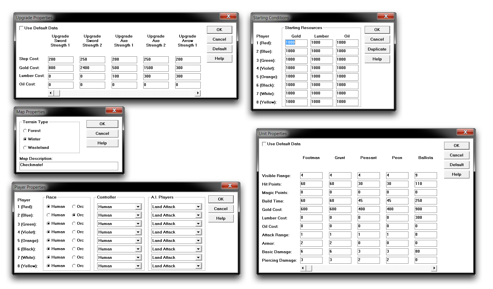
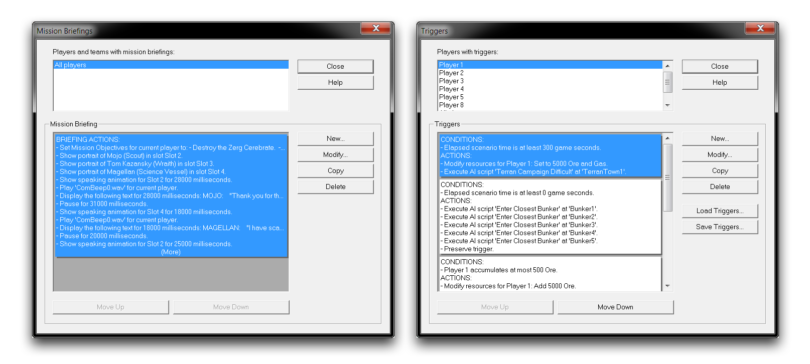
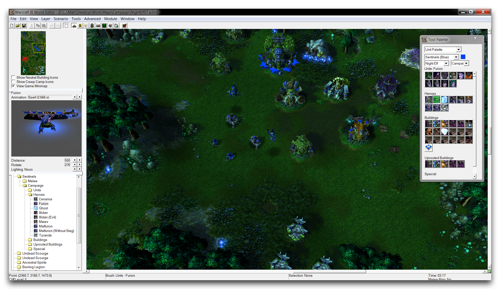
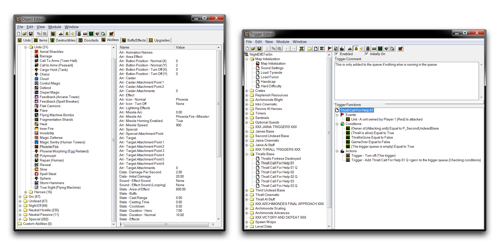

EDITOR HISTORY
==============

Blizzard has shipped a number of editing suites alongside its RTS games.
With each new release, the capabilities of the tools increased,
broadening the opportunities available to its community. It was this
long process of development and refinement that led to the StarCraft II
Editor we have today. This article will give a brief history of those
editors, many of which are still in active use, in an effort to provide
a better understanding of the StarCraft II Editor.

The WarCraft II Map Editor was released in 1995. For the first time,
players had the chance to step into the developer tools and create their
own maps, both for melee matches among friends and for custom campaigns.

Map Editor View

Notable New Features

-   For the first time, users could make custom missions for a Blizzard
    RTS with an Editor.
-   Terrain could be built using seven elements, on various sizes of
    maps.
-   All of the game's major resources could be placed on a map.
-   Use any units, buildings, and campaign heroes, and assign them to up
    to eight different player sides.
-   Configure the map to one of four available tilesets.
-   Edit upgrade costs, starting resources, and unit properties.
-   Assign each of the eight player sides to various AI controllers.

Under the WarCraft II Map Editor, all of a map's custom settings are
configured through five property windows, pictured below.

Editor Properties Windows

There was no support for any custom logic, objects, or similar with
which map creators could diversify a project. Still, there are many
unique maps that make use of creative terrain and unit placements to
build interesting experiences.

WarCraft II Map Creations

The StarCraft Campaign Editor was released in 1998. With support for
triggers, a type of scripting logic, the options available to map
creators broadened enormously. The new Battle.net also allowed players
to connect and share maps far more easily, leading to an explosion in
the audience for custom creations.

Campaign Editor View

Notable New Features

-   Now included a custom logic system through a Trigger Editor.
-   Pre-mission story mode sequences could be built using the Mission
    Briefings Editor.
-   Tilesets could be decorated with a layer of diverse, environmental
    doodads.
-   Fog of war data could be painted into a map.
-   Custom sounds could be imported and used for narrative sequences or
    other effects.
-   Locations that react to player input and drive triggers could be
    built onto the map.
-   Units and heroes could be renamed, giving map creators the ability
    to style the map to new imaginative themes.

The appearance of the new editors for mission sequences and trigger
logic broadened the editing experience immensely.

Mission Briefings Editor -- Trigger Editor

Thanks to the combination of an engaged online community and the
extended tools, a wide range of new game types and stories were shared.
Many innovations made with these tools led to developments in the the
broader gaming world.

StarCraft Map Creations

The WarCraft III World Editor was released in 2002. In an effort to
accommodate the move to 3D and the demands of WarCraft III, the Editor
grew to such a level of versatility and scale that it was broken up into
separate modules. The tools had become an editing suite, something that
offered its users controls for all the major disciplines of game
development.

World Editor View

Notable New Features

-   The Editor was now composed of eight modules: Terrain Editor,
    Trigger Editor, Sound Editor, Object Editor, Campaign Editor, AI
    Editor, Object Manager, and Importer Manager.
-   Entirely new units, objects, upgrades, abilities, items, and heroes
    could be created in a map's project data.
-   Custom cameras could be set up and then used dynamically during
    gameplay.
-   The trigger system was extended to offer significant game-time
    scripting.

The extension of almost every tool's capabilities resulted in the
Editor's growing into a modular toolset.

Object Editor Module -- Trigger Editor Module

At this point, the RTS editing tools had blossomed into a robust game
development suite. With a community that remains active today and a long
history of released projects, the WarCraft III World Editor remains a
favorite among students of design, hobbyists, and players.

WarCraft III Map Creations
