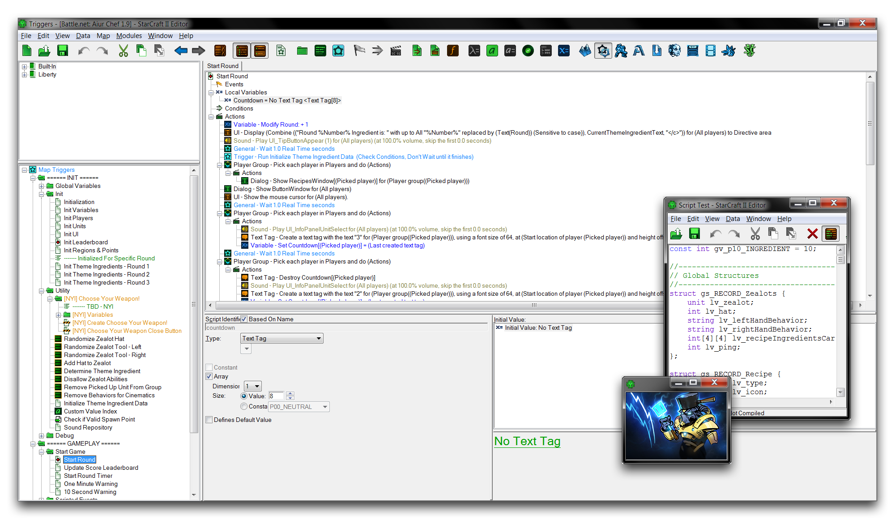

TRIGGER EDITOR INTRODUCTION
===========================

The Trigger Editor is where you'll build the logic underpinning your
project. Triggers are what will turn your Editor project into an
interactive, playable map. You can use this system to build games with
plain-language elements, meaning you won't need to use a programming
language. Using the Editor's pre-built library of these elements lets
developers work quickly and easily when making games.

Acclaimed for its intuitive, visual approach to programming, the trigger
system has been a long-standing favorite of amateurs and professionals
throughout the history of Blizzard RTS games. As a tool, triggering can
grow with its user, allowing them to eventually delve into programming
by investigating Galaxy Script, the language that works behind the
scenes of the system. Advanced use is supported through the Editor's
extensive feature set, including a profiler for use in debugging and
performance tuning.

Trigger Editor in Use

ELEMENTS
--------

The Trigger Editor operates through the construction of
 blocks of logic
and occur in response to
 that the game is
monitoring. Events can in turn be fitted with
 being monitored.
Triggers themselves are essentially containers for
 changes in the
game. The interplay of conditions, events, triggers, and actions creates
the essential game loop that brings a project to life.

There are also 
when an event occurs. Then
 it, or modify it
before reflecting it back to the game through an action. New varieties
of any of the basic elements can also be made through the custom
 actions, or
functions.

With  compound
data types and data can be named and sorted in
 documentation to
maps with 
 tame an
expanding project. With
 into objects
that are shareable between maps, friends, or team-mates. As a developer
learns and grows, they can start to make use of custom
 the programming
language that drives the whole engine.
