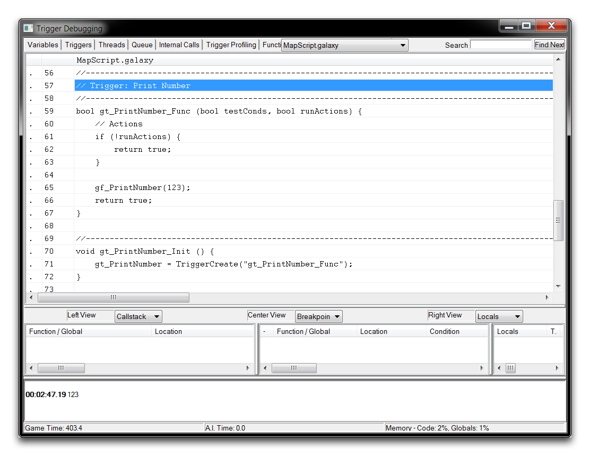
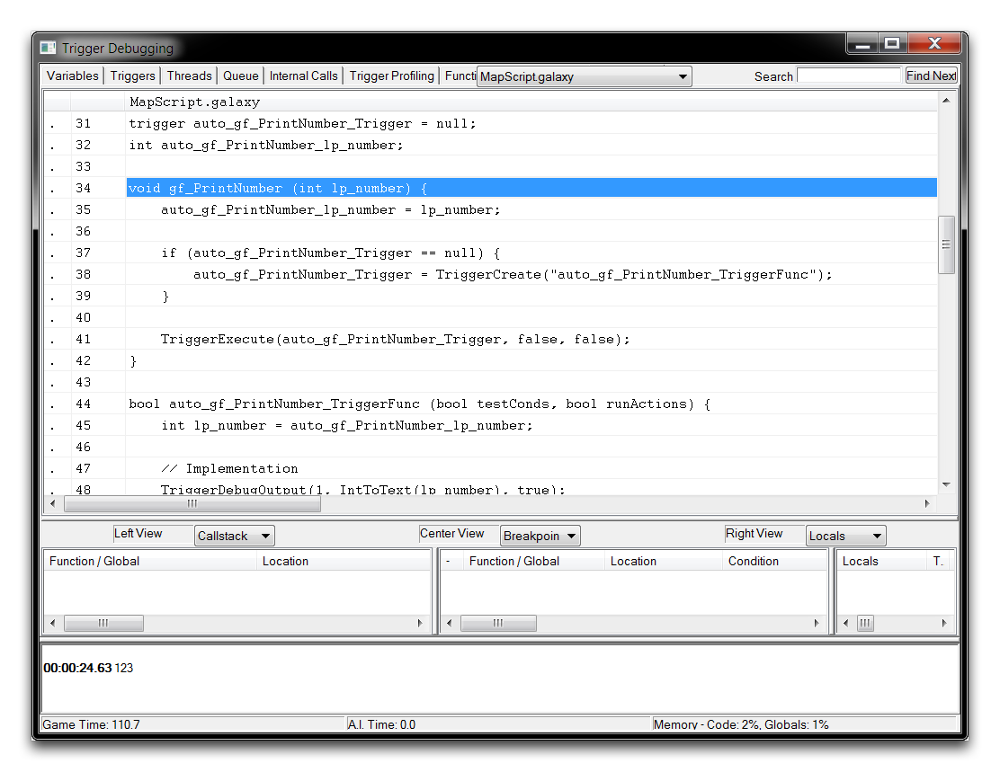

MULTITHREADING WITH ACTION DEFINITIONS
======================================

Multithreading is a computer science term that refers to a processing
unit's ability to execute multiple actions at once. Traditionally, the
standard behavior of a computer program is to execute all of its actions
sequentially, one after another. By disrupting this behavior,
multithreading allows a processor to perform actions in parallel,
handling many tasks at the same time, each in what's known as a Thread.
Take the following example of a linear operation system.

> Task 1 Start
>
> ...
>
> Task 1 Complete
>
> Task 2 Start
>
> ...
>
> Task 2 Complete
>
> Task 3 Start
>
> ...
>
> ...
>
> ...

Each of these tasks take some time to complete, and the system is only
capable of working on one at a time. A multithreaded system taking on
the same tasks might look more like the setup below.

> Task 1 Start Task 2 Start
>
> ... ...
>
> Task 1 Complete Task 2 Complete
>
> Task 3 Start Task 4 Start
>
> ... ...
>
> ... Task 4 Complete
>
> ... Task 5 Start

In this scenario, multithreading has allowed a variety of shorter tasks
to be organized into a separate thread. This has prevented the system
from being gummed up by the long Task 3, allowing the entirely new Task
4 and Task 5 to be considered in the same time frame. Systems capable of
multithreading have many advantages. For one, they can work efficiently
by breaking large tasks into smaller chunks that can be worked on
concurrently. In a gameplay context, multithreading is important for its
performance advantages, but also for its ability to open up different
ways of programming that can result in entirely new mechanics and
gameplay.

PROCESSING IN THE EDITOR
------------------------

By now you are probably fairly familiar with the way logic in the
Trigger Editor is executed. A trigger is called, then its internals,
actions, and control statements are run sequentially. Then the trigger
closes, proceeding on to the next in line. If a separate trigger or
action definition is called from a source trigger, then linear control
is passed, but ultimately it returns to its original source, running
sequentially until exhausted.

As such, triggers in the Editor operate as a standard, linearly
processed system. While this might not be accurate behind the scenes of
the code, where things are optimized to make use of multi-core systems,
ultimately this article concerns the front end tools of the Editor.
After all, the front end of the Editor is designed to be an intuitive
tool in which you can concentrate on designing and building your
project, rather than its precise programming details.

ACTION-DEFINITION THREADS
-------------------------

Still, the Editor is an inclusive system, and just as it offers an
intuitive front end for a wide range of users, it also has support for
multithreading to give advanced users the chance to make use of
non-linear processing. Multithreading is accessed through the use of
specially flagged action definitions. The flag option is shown below.

Multithreading Option within Action Definition

Setting the Create Thread flag within an action definition causes the
definition to be moved into a separate thread and handled in parallel to
the rest of the code whenever it is called. The operation of these
action definition threads themselves can be tracked and examined through
the Trigger Debugger.

USING MULTITHREADING
--------------------

Open the demo map provided with this article and move into the Trigger
Editor. Opening the 'Spawn Exploding Marine' action definition will
present you with the following.

Demo Map View

This definition creates a marine at the map's center, issues it a move
command, scales it over the course of five seconds, and finishes by
detonating it after five seconds. Turn your attention to the trigger
calling this definition, as shown in the image below.

Control Looping Trigger

This trigger starts immediately on opening the map and begins calling
the 'Spawn Exploding Marine' action definition once every second.
Logically this should result in about five active marines on the map,
undergoing the moving, scaling, and exploding behavior. A trial of the
map will give the result shown in the image below.

Single Marine in Motion

When testing this implementation, you will see that only a single Marine
is spawned at a time, with a period of about six seconds between each
spawn. This is due to the fact that the main thread, the looping
trigger, will pass linear control to the action definition it is
calling. From there, the action definition blocks all other triggers
from running until it's finished. This behavior clearly shows the
standard, linear processing behavior of the trigger system. To change
this, move to the action definition and enable multithreading, as shown
below.

Multithreaded Action Definition

If you test the newly multithreaded action definition, you should end up
with something like the image below.

Many Marine Spawning Actions via Multithreading

Now a new thread is opened for every call of the action definition.
Since the thread takes about five seconds to run, the loop manages about
five active threads, each separated by around a second. Knowing that the
marines get larger the longer their thread has been open means that they
serve as a great visualization of exactly how the system is managing
many threads at once.

IMPLEMENTATION
--------------

In actuality, the Editor's implementation of multithreading is kind of a
pseudo or impure version of the concept. While a true multithreading
implementation will be able to concurrently handle multiple tasks, the
Editor instead handles them through a method known as Time-Slicing.

In the Editor's version of time-slicing, a thread-enabled action
definition will run as typically expected when called. Linear control
will be passed to it, its statements will run sequentially, and then
control will pass back to the original parent caller. The difference
lies in what happens when it reaches a wait control statement. If it
does, control is interrupted and then passed back to the parent thread
until the wait has been resolved, at which point control will come back
to the threaded definition.

This differs from a non-threaded definition, which will hold on to
control until the wait resolves. As such, the Editor is 'faking'
multithreading by very rapidly switching linear control. This allows it
to avoid wait statements creating full stops in the code and, as a
result, it gives the impression of non-linear processing.

Still, giving users the ability to bypass wait statements like this
means that the Editor's pseudo-multithreading boasts a lot of the
utility that has been touted for the concept. It can still offer unique
or more intuitive ways to program certain effects, and can serve as a
valuable organizational tool. However, there is one important drawback:
performance.

Since no real parallel execution happens in the Editor's multithreading,
there is no specific positive impact on performance. In fact, because of
the added internal work of this option, multithreading in the Editor
will usually have a negative impact on performance. This is important to
keep in mind, since it disagrees with most of the general definitions of
the concept.

MULTITHREADING WITH GALAXY SCRIPT TRIGGERS
------------------------------------------

Galaxy offers some unique multithreading support through the
TriggerExecute native function. When executing a trigger directly with
this function, you can specify a parameter that sets the target trigger
to run in its own thread. The drawback here is that triggers have no
parameter inputs, making them less useful than action definitions in
most cases.

MULTITHREADING MECHANICS
------------------------

If you're an advanced user, you can gain insight into multithreading by
examining the Galaxy script implementation. Turn your attention back to
the demo map and disable the 'Spawn Exploding Marine' trigger and action
definition by highlighting them, then right-clicking and unchecking
'Enabled.' Now, look to the trigger 'Print Number' and its associated
action definition. The trigger calls the action definition pictured
below.

Print Number Action Definition

The action definition sends a simple debug message to the screen. Notice
that it is not currently set to be multithreaded. You can use this
trigger and definition as a simplest possible test trial for examining
the multithreading implementation. To do so, run the map in windowed
mode, then launch the Trigger Debugger. Once inside the debugger, move
to the Triggers Tab and right-click the gt\_PrintNumber\_Func trigger,
then select 'View Script.' This will show the standard action definition
script as follows.

Standard 'Print Number' Script

The script here is simple. It generates one void return function, the
format of which matches that of the action definition in the GUI. This
function is then called by the 'Print Number' trigger. Now, return to
the Trigger Editor and enable multithreading in the 'Print Number'
action definition by selecting the Create Thread flag. Repeating the
same debug procedure will give the following result.

Multithreaded 'Print Number' Script

In this case, the script is far more complex, consisting of many
automatically generated components. A breakdown of these components is
shown below.

1.  One global variable for each parameter of the action definition,
    matching its original type.

    > int auto\_gf\_PrintNumber\_lp\_number

2.  A global trigger variable with an initial value of Null.

    trigger auto\_gf\_PrintNumber\_Trigger = null

3.  A bool trigger function with two boolean parameters; this contains
    every action defined in the GUI and one implicitly generated local
    variable for each threaded action definition parameter.

    > bool auto\_gf\_PrintNumber\_TriggerFunc (bool testConds, bool
    > runActions) {
    >
    > int lp\_number = auto\_gf\_PrintNumber\_lp\_number;

4.  A wrapper function that accepts the action definition's parameters.

    > gf\_PrintNumber(123)

Knowing these pieces, the mechanism acts as follows.

-   The wrapper function in 4 runs, first copying its parameter values
    to the global parameter variables in 1.
-   The wrapper function then checks if the global trigger variable in 2
    is null. If so, it creates a new trigger based on 3, and assigns it
    to 2.
-   The function in 2 now executes in its own thread, obtaining the
    parameters from 1 and making local copies.

Note that the global in 1 serves as temporary storage, so it could be
accessed from the trigger. At this point, creating local versions allows
the thread to operate in parallel, insulated from any cases where the
variables change.

By now you can no doubt see the added complexity of the threaded version
shown here. As a result of this increase in code size, multithreaded
action definitions perform at a significant deficit when compared to
their unthreaded variety.
