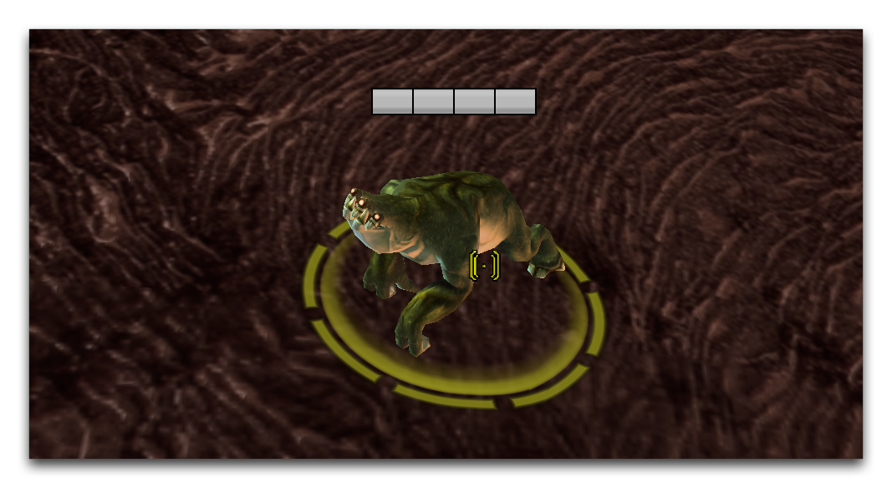
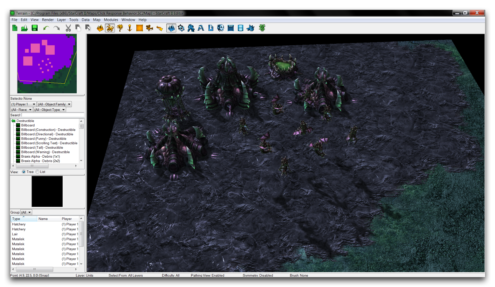
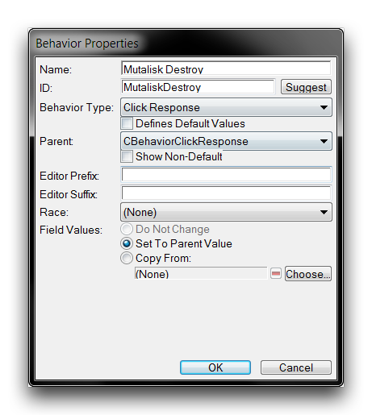
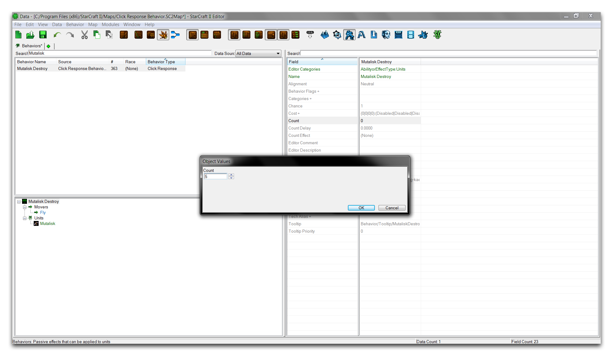
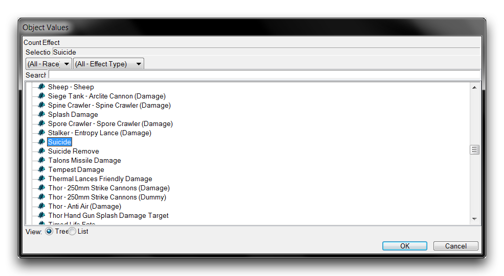
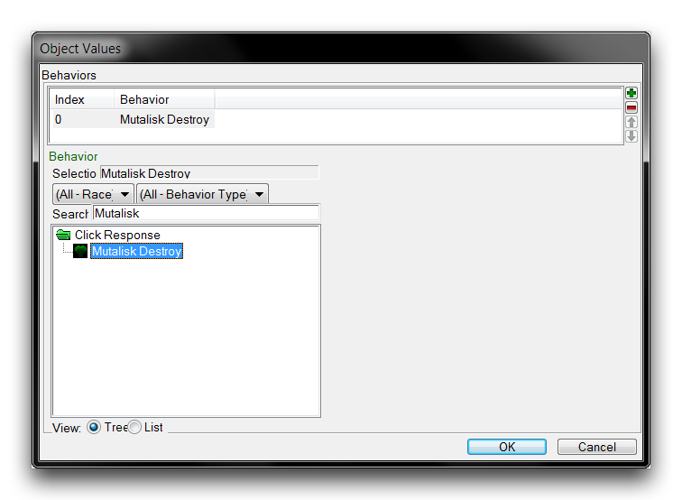
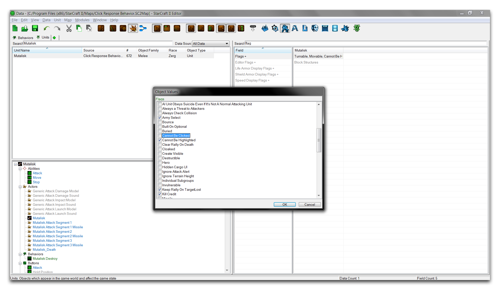
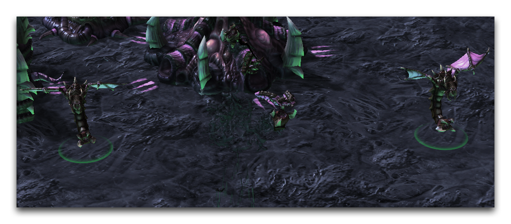

CLICK RESPONSE BEHAVIOR
=======================

The Click Response Behavior applies an effect in response to a player's
clicks on its hosting unit. This is an esoteric behavior that is used in
StarCraft's data dependencies just once, inside each map tileset's local
wildlife, the critters. If you weren't aware, critters in StarCraft, and
in the lineage of --Craft games, exhibit some spontaneous behavior after
being clicked repeatedly. If you haven't had the pleasure, there are far
worse ways to spend your time than testing this behavior now.

Click a Critter 30 TImes

Despite its lack of traditional use, the click response behavior shows
an interesting direct relationship between player input and a data
effect. It's worth investigating.

DEMOING CLICK RESPONSE BEHAVIOR
-------------------------------

Open the demo map provided with this article. There you'll find a small
Zerg base with a flock of mutalisks drifting outside, as shown below.

Demo Map Course

This course has been configured to allow the player to spawn mutalisks
from the hatcheries for free and at an accelerated pace. You'll take
advantage of this by adding a custom click response behavior that
destroys mutalisks after a series of clicks.

Start assembling the behavior by moving to the Data Editor and
navigating to the behaviors tab. If the tab is not already open you can
launch it by navigating to + -\> Edit Game Data -\> Behaviors.
Right-click inside the main behaviors window and select 'Add Behavior.'
This will appear as shown in the image below.

Creating a Behavior

In the behavior creation window, enter 'Mutalisk Destroy' as the name,
then click 'Suggest' to generate an ID. Now set the 'Behavior Type' to
'Click Response.' The finished creation window should like this.

Click Response Behavior Creation

Click 'Ok' to finish the creation and return to the main Data Editor
screen.

SETTING THE BEHAVIOR'S FIELDS
-----------------------------

Once you've created the behavior, select it to edit its fields. First,
move to the 'Count' field, where you will set the number of clicks
required to apply the behavior. Double click the field to launch a
'Object Values' window and set the 'Count' value to 5, as shown below.

Setting Behavior Click Count

Next, move to the 'Count Delay' field. Double click the field to launch
another 'Object Values' window and set its value to 0.5. This will set a
timer that runs between clicks. If this value is exceeded, the click
count will be reset. This can be useful if the behavior needs some sort
of protection against being set off accidentally during normal use.

Setting Behavior Count Delay

Now move to the 'Count Effect' field, select it, and double click to
launch its editing window. This field will set the effect to be
triggered in response to the clicks. This is a good location to come
back to later for experimentation, but for now select 'Suicide.' This
will command to unit to be removed on repeated clicking.

Setting Click Response Effect

Now select 'Ok' to finish the behavior's construction. The finished
fields should look as they do in the image below.

Completed Behavior Fields

APPLYING THE CLICK RESPONSE BEHAVIOR
------------------------------------

The behavior is now completely prepared and ready to be hooked into
gameplay. One nice attribute of this behavior type is that you can slot
it directly into a unit, making it quite easy to set up. This is
sensible, as the behavior grants an effect that responds directly to
player input, so the behavior's most natural location is within the unit
itself. You can make this connection by navigating to the units tab or
opening it via + -\> Edit Game Data -\> Units. From here, select the
'Mutalisk' and move to its 'Behaviors' field.

Mutalisk Behavior Field

Double click the 'Behaviors' field to launch the 'Object Values' window.
Right-click inside the 'Behaviors' box and select 'Add Value.' This will
add a blank behavior to the unit, as shown below.

Adding Mutalisk Behavior

Once created, highlight the new value and find the 'Mutalisk Destroy'
behavior with either the window's search feature or the scroll bar.

Mutalisk Destroy Behavior is Set

Click 'Ok' to select the behavior. At this point, you have one last
change to make to the unit. By default, units do not respond to player
clicks as a data event. They may be clickable and useable within the
gameplay view, but as a signal they produce no event on the data side of
things. To correct this, highlight the 'Mutalisk' and navigate to its
'Flags' field. Double click the field to launch it, then move to the
'Cannot Be Clicked' flag and deselect it.

Allowing the Mutalisk to be Clicked

Click 'Ok' to return to the main Data Editor view. The map is now
complete and you can run the 'Test Document' feature. If you inspect a
mutalisk inside the map, you'll find that they're now tagged with a
behavior status, as shown below.

Mutalisk with Mutalisk Destroy Behavior

Clicking on this mutalisk five times will reveal the design of this
behavior.

Mutalisk Click Response Effect
