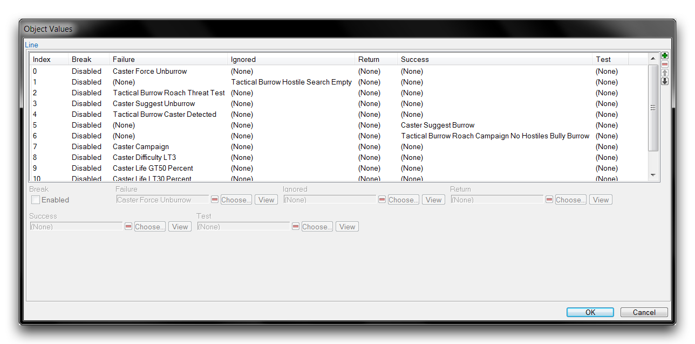
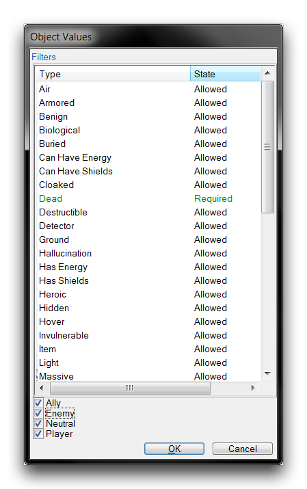

VALIDATORS RUNDOWN
==================

This article gives a breakdown of some of the different types of
validators. Each section describes the fields of its validator, as well
as providing some details on its use and application.

COMBINE
-------

The Combine validator joins a list of validators together. While
'Validators' fields typically support multiple validators, combining
them like this can be a useful tool for organization and clarity.
Combine validators can be sequenced indefinitely by repeatedly inserting
a combine validator into themselves.

  ----------------------------------------------------------------------------
  Field      Details
  ---------- -----------------------------------------------------------------
  Type       Selects an AND or OR combination of the terms. The AND
             combination requires that every validator be true for the
             combined validator to be true. By contrast, the OR combination is
             true as long as one of its validators is true.

  Combines   Sets the validators to be combined. These can contain another
             combine validator.

  Negate     Reverses the test result, any true results will draw as false and
             vice versa. This is also known as a NOT operator.

  Result --  Sets the error message to be distributed on failure.
  Failure    
  ----------------------------------------------------------------------------

You can see an example of a combine validator below.

Combine Validator Example

Here, three individual validators have been combined, Caster Not Dead,
Energy Not Full Caster, and Not Dead. You can use the Object Explorer
and Data Navigator to see this link in detail, as shown in the following
image.

Combine Validators Linkage Views

You should note that these visualizations will only ever display a
single hierarchical level of combinations. If the combine validator is
sequenced, you'll have to select any additional levels of combine
validators to see their component validators.

ENUMERATE AREA
--------------

The Enumerate Area validator performs a test by counting the objects in
an area and then comparing its count with a test value. Depending on the
result of this test, the validator will draw a true or false. It can
count objects in general or count only objects that test positively for
a certain validator.

  ----------------------------------------------------------------------------
  Field      Details
  ---------- -----------------------------------------------------------------
  Areas      Defines a list of areas to be searched. You can also define a
             validator for each area that will cause the search to only count
             objects with the validator. Not setting any validator in any area
             will result in a simple unit count.

  Compare    Defines the operator for comparing the number of objects located
             in the Areas with the Count.

  Count      Sets the test value against which the located objects are
             compared.

  Location   Checks the status of the ability. Enabled means it is occurring,
             Disabled means it is not occurring.

  Search     Sets the point on the map where the Areas are created and then
  Filters    searched.

  Search     Sets some option flags. Extend by Unit Radius will expand the
  Flags      area by the unit's Radius value. Same Cliff Level will only
             search for units sharing the same cliff level as the validator's
             host.
  ----------------------------------------------------------------------------

Once activated, an enumerate area validator creates its Areas at a
Location. It then counts how many objects meet its criteria within the
Areas, whether that means simply existing or having a defined validator.
That value is then compared with the Count test value by the operator
defined by Compare. If the value is successfully compared, it returns
true, if it is unsuccessful, it returns false. You can see an example of
an enumerate area Areas field being built below.

Enumerate Areas Search Area

FUNCTION
--------

The Function validator allows you to construct controlled sequences of
validators. Each step of the sequence tests a validator, then either
returns a result or moves on to the next test. The function validator
can contain an indefinite number of terms and each test can return
several types of unique results. This distinguishes it from the other
conditional validator, Combine, which must be sequenced to extend beyond
two terms and has tests that can each only return a simple true or false
result. The function validator is typically used to construct extensive
AI procedures.

Function validators are built in a subeditor view that you can access
through the Line field. The function validator proceeds through its
tests on a line by line basis in the order of the line Index, moving
from top to bottom. Each test measures if the validator set in its line
is true. Then, depending on which of the five fields the validator has
been placed under, an action is taken. An example of a function
validator is shown below.

Function Validator Composition

In this case, the first test is made on Caster Force Unburrow. If this
validator is found true, then the function validator returns Failure and
concludes. If the validator is found false, then the next line is
executed. The next line, Index 1, tests if Tactical Burrow Hostile
Search Empty is true. This happens to be an Enumerate Area validator. A
true result from it will result in the validator returning Ignored. This
will end the function validator. A false result will run the next line.
This process continues until the Index is exhausted. Clearly, this
validator can deliver a very robust profile of results. A breakdown of
the individual fields is shown in the table below.

  --------------------------------------------------------------------------
  Field     Details
  --------- ----------------------------------------------------------------
  Line      Sets the tests to be made by the validator on a line by line
            basis. There are five possible return results: Failure, Ignored,
            Return, Success, and Test. Break, described below, offers
            another control option.

  Break     Stops the validator once reached.

  Failure   If the selected validator is true, returns a Fail for the
            function validator overall and exits the test. This also
            displays any error messages that have been set.

  Ignored   If the selected validator is true, returns a Fail for the
            function validator overall and exits the test. This does not
            display any error messages.

  Return    Returns the same True or False result as the selected validator

  Success   If the selected validator is true, returns True for the function
            validator overall and exits the test.

  Test      If the selected validator returns true, then the other
            validators in the line are skipped. This can be used with an
            additional Failure, Ignored, Return, or Success validator to
            make an upfront test of an object.

  Result -  Selects the error message to be displayed on failure.
  Failure   
  --------------------------------------------------------------------------

LOCATION RANGE
--------------

Location Range validates the distance between two objects. Depending on
whether or not that range meets a test value, a true or false value is
returned. An example of a location range validator is shown below.

Location Range Validator

  -----------------------------------------------------------------------
  Field           Details
  --------------- -------------------------------------------------------
  Range           Sets the distance to be tested using the Compare
                  operator.

  Compare         Defines the operator for comparing the Range from one
                  object to another.

  Location        Sets the starting point for measurement.

  Value - Value   Sets the end point for measurement.

  Result --       Sets the error message to be displayed on failure.
  Failure         
  -----------------------------------------------------------------------

PLAYER REQUIREMENT
------------------

The Player Requirements validator tests the status of a certain
requirement for a player.

Player Requirement Validator

  ---------------------------------------------------------------------------
  Field    Details
  -------- ------------------------------------------------------------------
  Value    Sets the Requirement to be tested.

  Find     Selects how the unit will be tested. Enabled means the unit being
           identified as the selected unit type will return as True, while
           not being identified will return as False. Disabled means a unit
           being identified as the selected unit type will return as False,
           and not being identified will return as True.

  Player - Specifies the player that the validator will target.
  Value    

  Result   Selects the error message to be distributed if a player is not set
  -- No    or found.
  Player   
  ---------------------------------------------------------------------------

UNIT TYPE
---------

The Unit Type validator tests whether or not a unit is of a specified
type. You can see one example of a unit type validator below.

Unit Type Validator

  ----------------------------------------------------------------------------
  Field     Details
  --------- ------------------------------------------------------------------
  Unit -    Sets the Unit to be tested.
  Value     

  Value     Sets the type of unit which the Unit - Value will be tested to be.

  Find      Selects how the unit will be tested. Enabled means that the unit
            being identified as the selected unit type will return as True,
            while not being identified will return as False. Disabled means a
            unit being identified as the selected unit type will return as
            False, while not being identified will return as True.

  Result -  Selects the error message to be distributed on failure.
  Failure   
  ----------------------------------------------------------------------------

UNIT FILTERS
------------

The Unit Filters validator checks whether or not a unit contains the
specified filters.

Unit Filters Validator

  -----------------------------------------------------------------------
  Field             Details
  ----------------- -----------------------------------------------------
  Filters           Sets the filters to be tested for.

  Unit - Value      Sets the Unit which will be examined for the filter
                    states.

  Result - Failure  Sets the error message to be displayed on failure.
  -----------------------------------------------------------------------

Filter selection can target both a unit's state and its alliance status,
as shown below.

Filter Selection View

UNIT COMPARE BEHAVIOR COUNT
---------------------------

The Unit Compare Behavior Count validator compares the behavior stack
count on a unit with a test value. Depending on the comparison, a true
or false value is returned.

Unit Compare Behavior Count Validator

  -----------------------------------------------------------------------
  Field          Details
  -------------- --------------------------------------------------------
  Behavior       Sets the Behavior to be tested for.

  Compare        Defines the operator for comparing the behavior stack
                 count with a test value.

  Value          Sets the test value that the behavior stack count is
                 compared to.

  Unit - Value   Sets the unit being tested for the Behavior.

  Result -       Sets the error message to be displayed on failure.
  Failure        
  -----------------------------------------------------------------------

You should note that a unit is typically considered to have a behavior
at a stack count of 1. As such, this validator is commonly employed to
test if a behavior can be applied to a unit or if that unit already
possesses that behavior. In this case, the test examines if the behavior
stack is Equal To a test Value of 0. If this returns True, the unit does
not currently possess the Behavior and it may be applied. If it returns
False, the unit already has the Behavior and should not receive an
additional stack as the design does not support this.
