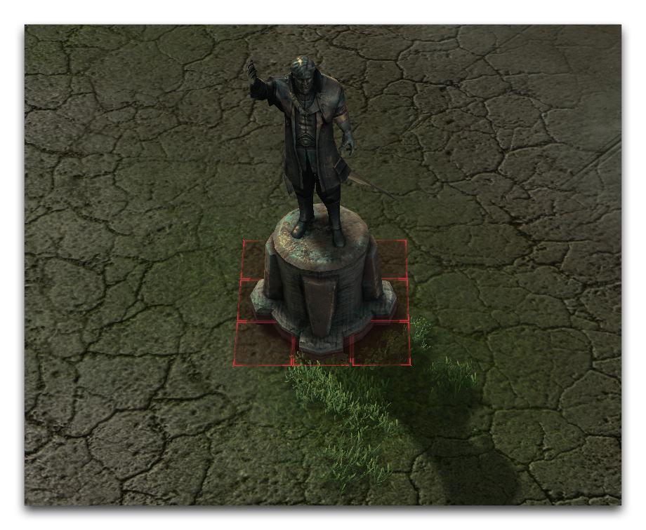
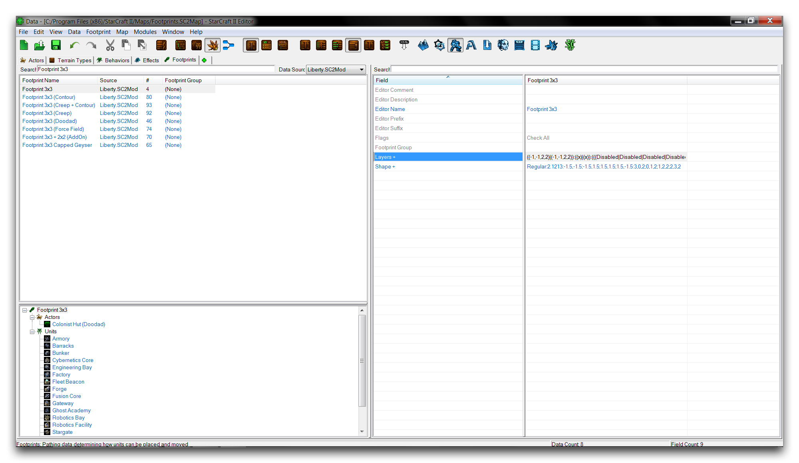

FOOTPRINTS
==========

Footprints attach pathing to other objects. Take a statue doodad as an
example. To function in the Editor, it must prevent units from walking
through it and clipping the model. A footprint can be used to prevent
this by being attached to the doodad, creating a pathing blocker around
the statue's area. You can see this in the image below.

Doodad Footprint

The doodad has sectioned off a grid area where neither unit pathing nor
building can occur. The type is determined by the amount of pathing area
the footprint takes up on a unit grid basis. This footprint is a 3x3,
measuring three units in both axes. You can view and edit footprints by
moving to the Data Editor and navigating to + -\> Edit Game Data -\>
Footprints, as shown below.

Navigating to Footprints in Data

FOOTPRINT DETAILS
-----------------

Selecting a footprint in the Editor will show its fields in the right
subview and its connected objects in the Object Explorer. A footprint
hooks into an actor through the 'Footprint' field and a unit through its
'Pathing Footprint' field. You should note that, when it comes to units,
many buildings have their own footprints, but actual moveable ground
units handle pathing with their own systems. Below you'll find an image
of the footprints tab and a breakdown of its essential fields.

Footprint Data Fields

  -----------------------------------------------------------------------------
  Fields      Details
  ----------- -----------------------------------------------------------------
  Footprint   Sets the index category within the editor. Most footprints are
  Group       found under the default Generic or blank grouping. Some unique
              footprints for destructibles and uncommon shapes are found under
              the SpecifcDoodads grouping.

  Layers      Determines the composition of pathing applied to the footprint.
              This can be altered using the Footprint Editor.

  Shape       Determines the visible shape of the footprint. This can be
              altered with the Footprint Editor.
  -----------------------------------------------------------------------------
