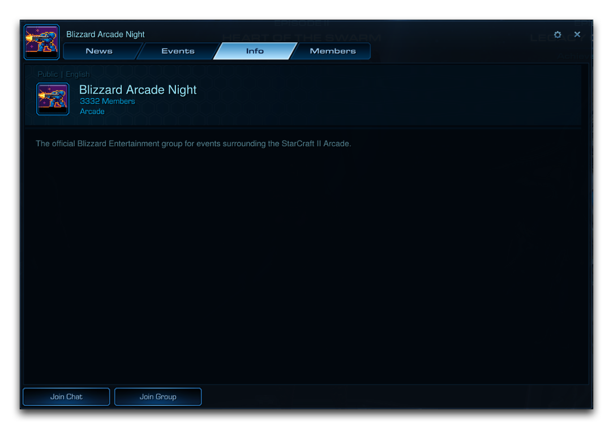

Marketing

Eventually the time will be right to release your project into the
world. Putting some effort into how you do this can have a huge impact
on the number of people interested in it. Marketing your game and
building hype is a great way to increase your game's chances of being
successful. While there is always a chance that pure word of mouth will
be enough, you can't underestimate the value of going on the offensive.
Even if your game is unfinished or still in active development, starting
a marketing effort can pay off by giving you additional feedback,
willing testers, and other opportunities. Despite all this, good
marketing starts with a good project. It's important that you don't get
ahead of yourself. Concentrate on the important thing first, the
practice of game design.

PROMOTIONAL MATERIALS
=====================

You'll want to have materials that can show off your game in various
locations. While Battle.net and the Arcade have many preview features,
you can't rely on people encountering your project through the game
itself. There are already many things going on there, and you have to
compete for attention to start building your own niche. Promotional
items such screenshots, video, a website, sharply written copy, and
illustrations can be employed in many capacities to push your project to
a wider audience.

It's good to have some idea of your target audience here. If the project
is a melee map appealing to competitive StarCraft players, show things
they would enjoy, like new advancements in play or features designed to
promote high-level balance. If the game appeals to fans of a certain
genre, look at what other things in the space have done, try to hit some
of the same points while offering your own innovations.

Trailers, or short promotional films, can be particularly effective.
When creating these, you'll want to film at the best possible resolution
and game settings, while keeping things concise. In the earliest part of
your trailer, try to include something that highlights the unique
features of your project, gets people's attention, and makes them
actually find the project to try it out. Show the salient points of your
project, introduce new ideas at a good pace, and don't linger too long
on things that might not be interesting to someone who hasn't tried it
before.

PUBLICIZING
===========

With your promotional materials in hand, it's time to get the word out.
Be sure to scour community sites and meeting grounds you think are
appropriate, as well as the official Blizzard forums. Make a list of
where you want to market and prepare a general template from your
materials. Don't just wallpaper places with thoughtless spam. Take the
time to work from your template in each scenario, tailoring your
approach and communication to each space. Some general ideas for
publication may include:

-   Posting to StarCraft community forums.
-   Sending some messages out on social media.
-   Linking your project to gaming website editors or bloggers.
-   Reaching out to community figures who may be interested.
-   Showing your project to StarCraft streamers who could be interested
    in trying it.

When making a dedicated marketing launch of something, try to
concentrate your efforts on a short window of time, this will multiply
its effectiveness by getting your project talked about in multiple
places at once. Despite this, don't give up if your initial marketing
push has tepid results. Sometimes it takes a slow burn to build
interest; keep your materials public and updated, and try putting in a
smaller constant level of publication effort over time. Don't let
perpetual marketing keep you from developing though, a project may have
a breakthrough with additional work or could even lead you to something
new. After all, there's always the next project.

MAINTAINING THE COMMUNITY
=========================

Marketing does not necessarily end after launch. You may want to put
effort into building a community to continue growing and developing your
project. If it's a multiplayer game made for repeated play, you'll want
to consider any materials that can unite the playerbase, allowing them
to get in touch with one another. A simple website can be effective for
this and can even have its own discussion forum attached to it. The
Battle.net system allows you to publicize a single website for each
project. You can add this from the Editor by navigating to Battle.net
Info -\> General -\> Website, as shown below.

Battle.net Website Link

Use the 'Test' button to make sure the link is properly attached.
StarCraft II also supports a feature called 'Groups.' Groups are a great
way to start a hub where players can gather on Battle.net. You can even
create 'Events' within groups, setting scheduled play sessions or
meetings that are displayed on the StarCraft II home screen for members
of the group. It's also worth your while to check out the 'Blizzard
Arcade Night' group, which hosts events specifically tailored for
developers to market and test their projects in front of an audience.

Blizzard Arcade Night Group
