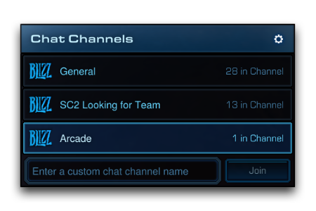
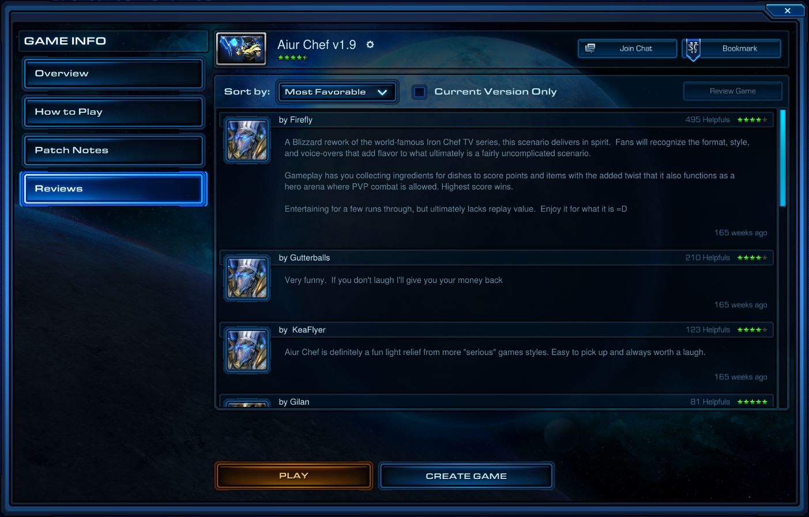
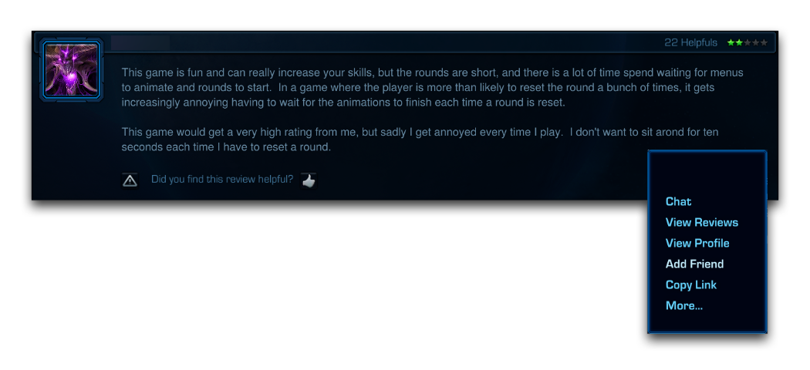

FINDING TESTERS
===============

Game development requires a lot of testing to produce good results. Many
of the best developers acknowledge that close observation and
experimentation with the game is likely the most important design
practice. Games are constantly changing systems, which can often make
them counterintuitive. There are many unexpected behaviors that are best
discovered, remedied, or even harnessed by frequent testing. Proper
observation of a game is a matter of time, technique, and perspective.
Perspective is best achieved by getting out of your own head and
enlisting some fresh eyes for assistance, usually in the form of game
testers.

The term 'tester' refers to a volunteer who will play an experimental
Arcade game, battle on a new melee map, observe using a custom
interface, or in any way use a creator's project, then report back on
their experience. Despite the public's enthusiasm for creative projects
using the Editor, it can often prove difficult or extremely time
consuming to find testers who are both willing and effective. There are
several practices that can help you combat this.

PREPARING FOR A SESSION
-----------------------

Holding an effective test means preparation. Being the benefactor of
other people's volunteer effort means taking on the responsibility of
making the test productive, focused, and as interesting possible given
the current state of the project. While a faulty map can weigh heavily
on a developer's conscience, it is important to not rush to multiplayer
testing as a first response. Always make sure to exercise your abilities
to design, diagnose, and repair on your own first. While you need to get
other people's perspectives to grow as a developer, it's also important
to foster personal discipline.

When you're ready to move into multiplayer testing, you should consider
uploading a project build, which is a version published separately from
the main release. This can keep the standard version clean and helps
make sure you don't disrupt any players currently enjoying your project.
It can even allow you to share a low key, unlocked version of the game.
This is useful if you're looking for perspective from other developers
on matters internal to the map, like triggers or data.

Testing is a rather general term and proper preparations can vary
wildly. Good testing could mean taking the time to find highly skilled
players to gain insight on a particular competitive map design, or
making sure interface elements are fine-tuned enough to let new players
get to the meat of an Arcade game.

In general, you want to isolate some part of your game. You should think
about adding as many provisions as possible to proceed to the part of
the game that is of particular interest and test it efficiently. This
could mean introducing commands to skip opening cutscenes, or functions
built into the game to repeat game elements for multiple tests. Ensure
that each session has well-defined objectives and that these are made
clear to your testers before beginning a test.

Some developers will use tests as promotional previews, a type of
marketing. This won't be addressed here, but can be an effective tool in
building a community. Any following your game gains can contribute to
actual testing, more interested parties means more potential testers. As
a rule of thumb for the would-be developer, marketing is best
accomplished by just working to make a better game.

CONTACTING PLAYERS
------------------

Contact potential testers through forums, chat clients, social media,
and Battle.net's built-in community features. Take advantage of any
available channels to get in touch with fellow StarCraft II players and
developers. StarCraft II community sites and other game-focused
communities often support their own active forums and IRC channels.

Keep a flexible schedule. Remember to publish your game to all regions,
as interested testers could live anywhere in the world. Coordinate with
the people in different regions and time-zones to include as many
players as is possible. For players available at times outside your own
schedule, you can always elect to have someone else host the test. If
you are part of a team, you can divide and conquer, hosting several
tests at once.

When you're ready to test, start by reaching out to your peers in the
community. Developers can make for particularly strong testers, and
offer a degree of technical help that the average player simply can't.
Developers may also have their own contacts, willing testers to whom
they could introduce you. All that aside, you could always try inviting
players from Battle.net public chat channels such as 'SC2 Looking for
Team' or 'Arcade.'

Arcade-centric Chat Channels

ORGANIZING TESTERS
------------------

Now that you've built yourself a rolodex of interested players, you can
begin testing your game. Rather than rounding up your tester team this
way for every session, use Battle.net features to help you organize
these events. Maintain more consistent contact through the use of chat
channels and groups.

Battle.net groups offer some tools for managing and communicating with
testers. Create a group by navigating to the 'Groups' button on the main
toolbar, found between 'Friends List' and 'Menu.' This will launch the
'Create A Group' window, where you'll prepare your group. Once you have
everything decided, select 'Create' to add the group to Battle.net.
These properties are relatively innocuous, but you'll likely want to set
the group's 'Privacy' to public to facilitate visitors. You should also
note that clans based around games do exist, but the fact that players
can only be in a single clan at a time within Battle.net could
discourage potential testers.

Group Creation

If you've published your game to the Arcade as Public, then you can use
the 'Join Chat' button from the 'Game Info' screen to enter an
automatically generated chat hub for the game. Otherwise, you can always
make your own chat channels. An additional tip is to mention groups,
chat rooms, and other community locations you are using in your game's
'Map Info' Description, in its loading screen, and in the game itself.

FEEDBACK
--------

Make sure to provide a channel of communication, like email or social
media, alongside your map. This can prove useful as a means of gathering
feedback. Remember that Battle.net also offers a 'Reviews' window for
active games, which can be another source of insight into how players
are enjoying your game.

Reviews Screen

Finding tough-but-fair constructive criticism here can give you a great
lead on potential testers. Don't hesitate to reach out to players who
put effort into critiquing your game in a respectful manner. You can
send them friend requests through Battle.net and strike up a
conversation about their experience with the game. Good developers ask
good questions.

Constructive Feedback

If you're still struggling to build a tester base after all this,
remember that some types of project seem to have better luck finding
testers. Some games are more enjoyable to test, while others need to
spend a long time in development just to be playable. Different genres
demand very different amounts of time and skill from players. If you are
plagued by a lack of testers, try solving the problem with design. You
can always try imagining a game that's easier to test. This doesn't
necessarily mean compromising your interests, be creative. Remember,
more testing means more opportunities to observe play, make changes, and
improve as a developer.
